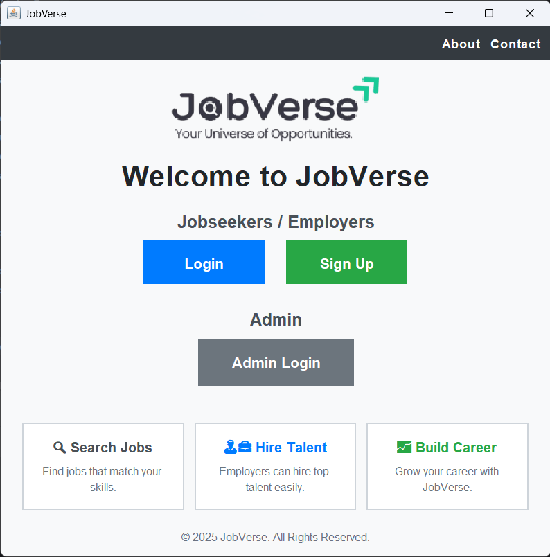

# JobVerse

JobVerse is a full-stack **Java Swing-based Job Portal** with a **MySQL backend**. It connects **Job Seekers**, **Employers**, and **Admins** in one secure ecosystem with role-based dashboards, real-time chat, and analytics.

## ✨ Features

### 👤 Job Seeker
* Browse and search jobs with filters
* Apply to jobs and upload resumes (stored as BLOBs)
* Save jobs for later
* View application status and notifications
* Chat with employers in real-time

### 🏢 Employer
* Post, edit, and delete job listings
* View applications and shortlist/reject candidates
* Schedule interviews and send offer/interview letters via Gmail API
* Chat with job seekers in real-time

### 🔑 Admin
* Manage users, employers, and job postings
* Ban / Unban / Delete / Reset accounts
* Access analytics and dashboards

## 🛠️ Tech Stack
* 💻 **Frontend:** Java Swing
* ⚙️ **Backend:** Java + JDBC
* 🗄️ **Database:** MySQL
* 📂 **Storage:** BLOBs for resumes

## 🚀 Setup

### Option 1: Using `.properties` file
1. Copy `application.properties.example` → `application.properties`
2. Fill in your local DB credentials:

```properties
DB_URL=jdbc:mysql://localhost:3306/JobVerse
DB_USER=root
DB_PASS=your_password_here
```

### Option 2: Using Environment Variables (Windows PowerShell)

```powershell
setx DB_URL "jdbc:mysql://localhost:3306/JobVerse"
setx DB_USER "root"
setx DB_PASS "your_password_here"
```

### ✅ Usage in Code
```java
String url = System.getenv("DB_URL");
String user = System.getenv("DB_USER");
String password = System.getenv("DB_PASS");
```

This ensures:
* 🔒 No sensitive data in GitHub repo
* 💻 Developers can still run the project locally

## ▶️ Run the Project

1. Open the project in IntelliJ IDEA (or your preferred IDE)
2. Ensure MySQL is running and database `JobVerse` is created
3. Run `Main.java` from the src folder

## 📺 Demo

🎥 [Demo Video](#)

### 📸 Screenshots

**Landing Page**



**Job Seeker Dashboard**


**Employer Dashboard**


**Admin Dashboard**


## 📁 Project Structure

```
JobVerse/
├── .idea/                   
├── Images/                    
│   ├── Admin Dashboard.png
│   ├── DefaultProfile.png
│   ├── Employers Dashboard.png
│   ├── JobSeekers Dashboard.png
│   ├── JobVerse-removebg-preview.png
│   ├── LandingPage.png
│   └── company_logo.png
├── resources/
├── src/                      
│   ├── About
│   ├── AdminDashboard
│   ├── AdminLoginPage
│   ├── AdminSignUpPage
│   ├── ApplyForm
│   ├── CompanyProfile
│   ├── Contact
│   ├── EChatSys
│   ├── EmployerDashboard
│   ├── JobSeekerDashboard
│   ├── JSChatSys
│   ├── JSProfile
│   ├── LandingPage
│   ├── LoginPage
│   ├── Main
│   ├── ReportPanel
│   └── SignUpPage
├── .gitignore                 
├── JobPortal.iml             
└── README.md                  
```

## 🤝 Contributing

1. Fork the repository
2. Create a new branch
   ```bash
   git checkout -b feature-name
   ```
3. Make your changes
4. Commit your changes
   ```bash
   git commit -m "Description of changes"
   ```
5. Push to your branch
   ```bash
   git push origin feature-name
   ```
6. Open a Pull Request

## 📬 Contact

**Yash Raut** – yashdr2405@gmail.com

🔗 [LinkedIn](https://www.linkedin.com/in/yash-raut-240505-yr30)

🌐 [GitHub](https://github.com/YashRaut24)
